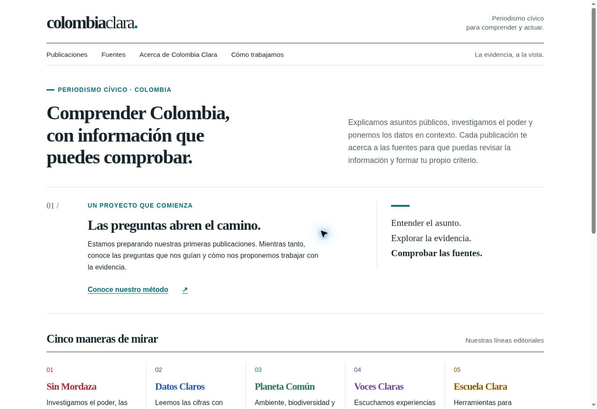
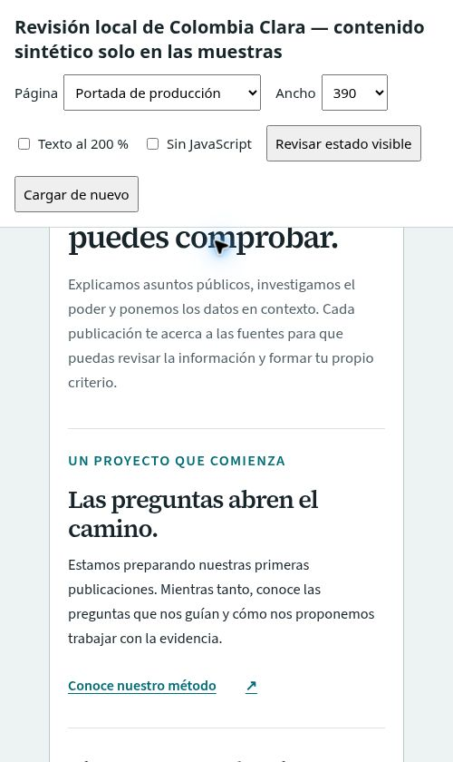

# Informe de validación

Fecha de cierre técnico: **10 de septiembre de 2026**. Este informe distingue las comprobaciones ejecutadas de las que quedan a cargo del repositorio de destino.

## Resultado

| Control                                    | Resultado observado                                                                                                         |
| ------------------------------------------ | --------------------------------------------------------------------------------------------------------------------------- |
| Contratos JSON y plantillas                | 20 JSON de plantillas válidos; contenido real y fixtures validados con JSON Schema 2020-12 y reglas editoriales adicionales |
| Tipos                                      | Astro Check y TypeScript estricto: 0 errores y 0 advertencias tras limpiar los imports de prueba                            |
| Componentes                                | 36 componentes React reutilizables y 36 archivos de prueba correspondientes                                                 |
| Pruebas                                    | 40 archivos, 69 pruebas unitarias y de integración; todas aprobadas                                                         |
| Producción con base `/`                    | 11 páginas HTML y 35 archivos; enlaces, anclas, recursos, metadatos y exclusión de borradores aprobados                     |
| Producción con base `/colombia-clara-web/` | 11 páginas HTML y 35 archivos; las mismas comprobaciones aprobadas                                                          |
| Demostración aislada                       | 15 páginas HTML y 53 archivos; dos publicaciones sintéticas publicadas y un borrador físicamente excluido                   |

La cifra final de pruebas se actualiza automáticamente al ejecutar `npm run check`; este documento registra la ejecución de cierre, no sustituye el log de CI.

## Revisión en navegador

La prueba se realizó sobre salidas estáticas y con fuentes locales, no sobre archivos abiertos mediante `file://`.

- Portada de producción observada a 320, 390, 768, 1024 y 1440 px: sin desbordamiento horizontal.
- Transferencia inicial móvil en frío de la portada: **129.526 bytes** para HTML, CSS y cinco fuentes solicitadas; no se cargaron JavaScript ni imágenes en esa vista. Presupuesto: 500 KB.
- Fuentes tipográficas: estado `loaded`; no hay llamadas a CDN, analítica, cookies ni píxeles.
- Axe, reglas WCAG 2 A/AA y 2.1/2.2 AA: 0 infracciones automáticas en portada, lectura de muestra, ficha de fuente, búsqueda y catálogo de gráficos. Axe marcó un elemento de contraste como `incomplete` en la portada; fue revisado visualmente, pero la evaluación automática no sustituye una auditoría humana.
- Lectura y fuente: la cita abre la ficha correcta y cada uso vuelve al ancla estable del bloque; la recarga directa conserva la ruta física.
- Búsqueda: ignora mayúsculas y tildes; filtros y consulta se reflejan en la URL y se restauran con atrás/adelante.
- Gráficos: se comprobó el filtro de series, la tabla equivalente, el CSV filtrado, el JSON original y la declaración de valores ausentes. Una regresión automatizada cubre además el selector accesible de registros.
- Sin JavaScript: el HTML generado contiene lectura, fuente, gráficos y tablas; los controles interactivos se ocultan y permanecen las rutas físicas y los índices navegables.

La batería E2E reproducible está en `tests/e2e/site.spec.ts`. El workflow instala Chromium y la ejecuta sobre `/` y `/colombia-clara-web/`; también genera capturas a 390 y 1440 px. Esa ejecución de GitHub Actions solo puede confirmarse después de subir el repositorio y habilitar Pages.

## Capturas





La segunda imagen conserva deliberadamente los controles del arnés para evidenciar el ancho seleccionado. Ninguna de las capturas forma parte de `dist/`.

## Límites que requieren criterio humano

- El build valida estructura, relaciones, fechas, unidades y reglas de representación; no puede certificar la veracidad de una afirmación ni los derechos sobre una imagen.
- Toda publicación con `status: published` sigue requiriendo revisión editorial. Los marcadores `autor-por-definir`, `src-por-definir` y `unidad-por-definir` bloquean la publicación.
- La accesibilidad automática no sustituye pruebas con lectores de pantalla, ampliación real, navegación exclusivamente táctil y usuarios diversos.
- Los fixtures son sintéticos y llevan una advertencia visible. La compilación de producción no contiene sus artículos, fuentes ni el centinela del borrador.

## Repetir la validación

```sh
npm ci
npm run check
npm run build
npx playwright install chromium
npm run test:e2e
```

Para una comprobación de la base raíz:

```sh
CC_BASE_PATH=/ npm run build
```
